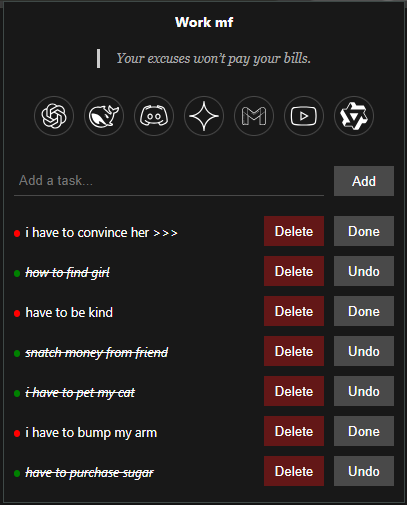

# 🔥 To-Do List 

A minimal and productivity-focused ToDo that lets you manage tasks, store shortcuts, and get daily Gen-Z motivational quotes to keep you grinding.





## 🚀 Features

- ✅ Add/Delete/Mark tasks as done
- 🌐 Access shortcut links
- 🧠 Motivational Gen-Z quotes on load
- 💾 Auto-save with `localStorage`
- 🎨 Simple UI (customizable with CSS)


## 🛠️ You can add HTML divs with inline css:-

example code-

```html
 <div style="color: #4ab580; font-weight: 600; font-size: 1.1rem; padding: 12px 20px; background: rgba(255,255,255,0.05); border-left: 4px solid #4ab580; margin: 15px 0; animation: slideFade 1s ease-out forwards; opacity: 0;">
  🚀 Just launched... but still in beta chaos!
</div>

<style>
@keyframes slideFade {
  0% { transform: translateX(-30px); opacity: 0; }
  100% { transform: translateX(0); opacity: 1; }
}
</style>
```


1. Clone this repository or download the ZIP.
2. Go to `chrome://extensions/`
3. Enable **Developer mode**
4. Click on **Load unpacked**
5. Select the folder containing this extension

## 📋 Usage

- Add tasks from the input field and click `Add` or press `Enter`.
- Click `Done` to mark a task as complete (applies strike-through but most of the time doesnt work with `HTML` elements. ).
- Click `Delete` to remove a task.
- You  can update the shortcuts by manipulating codebase.
- Reload page to see a new quote.

## ⚡ Tech Stack

- HTML
- CSS
- JavaScript (Vanilla)

## 🙌 Contribution

Feel free to fork this repo and submit pull requests for new features, bug fixes, or performance improvements.

## 📄 License

MIT License

